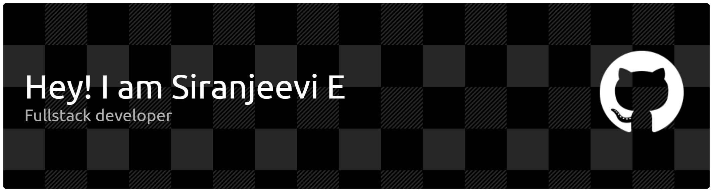

<h1 align="center">Hi 👋, I'm Siranjeevi E</h1>
<h3 align="center">Full-Stack Developer | AI Enthusiast | Computer Science Engineer</h3>

---

# 👨‍💻 About Me

I am a **Full-Stack Web Developer and AI Enthusiast** with a strong foundation in computer science and modern web technologies.

I enjoy building **scalable applications, intelligent AI systems, and secure backend architectures** that solve real-world problems.

**Core Interests**

- Full-Stack Web Development  
- Artificial Intelligence & Machine Learning  
- Backend API Development  
- Secure System Design  
- Performance-Focused Applications  

---

# 🌍 Coding Profiles

---

# 🛠 Tech Stack

### Programming Languages

---

### Full Stack Development

---

### Databases

---

### Operating System

---

# 🚀 Areas of Interest

- Full-Stack Web Applications  
- AI & Computer Vision Projects  
- Backend API Development  
- Secure System Architecture  
- Database Design & Optimization  

---

# 🎯 Current Focus

- Building modern **Full-Stack applications**
- Developing **AI-based intelligent systems**
- Improving **backend architecture**
- Practicing **Data Structures and Algorithms**

---

⭐ Always learning, building, and improving.

